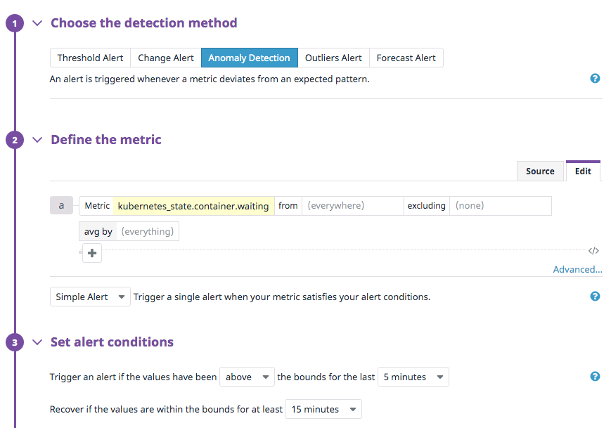
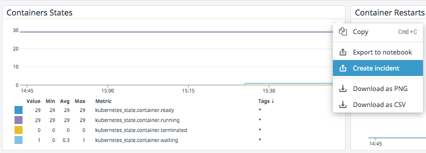
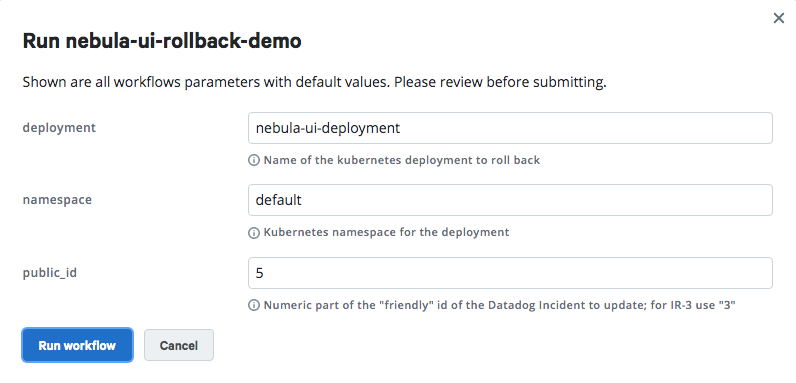
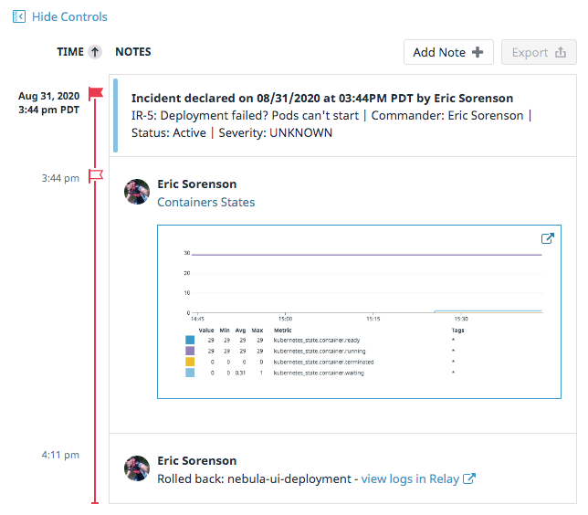

Datadog is an awesome tool for aggregating and visualizing the metrics that matter to you. Recently, Datadog launched a new Incident Management feature, which allows you to coordinate the activities around a problem that affected your service. In this example, I'll walk through using Relay to roll back a Kubernetes deployment that caused a service impact, and show how the Datadog Incident timeline can keep everyone working on the incident in sync.

## Datadog setup

In Datadog, I've created an Anomaly Detection monitor to watch my Kubernetes cluster for failed deployments - apps that can't deploy can either get stuck in `CrashBackOff` or `ImagePullBackOff` loops. In both cases you'll see the `kubernetes_state.container.waiting` metric increase, to indicate the number of unschedulable pods. 



I'm not using it for this example, but it's worth mentioning that Relay has an integration with Datadog monitors. Using the [Webhooks integration](https://docs.datadoghq.com/integrations/webhooks/) in Datadog and Relay's [webhook triggers](https://relay.sh/docs/using-workflows/using-triggers/), you can kick off notification, remediation, or troubleshooting workflows in response to Datadog alerts. Relay's [Datadog integration page](https://relay.sh/integrations/datadog/) has several examples of this.

## Relay setup

In Relay, I've built a rollback workflow that takes the name of a `deployment` and rolls it back to the previous version using the [Relay `kubectl` integration](https://github.com/relay-integrations/relay-kubernetes/tree/master/steps/kubernetes-step-kubectl). The latest version of the code is available for you to try out in the [Relay workflows repository](https://github.com/puppetlabs/relay-workflows/tree/master/datadog-k8s-rollback). Here's an annotated version to introduce some Relay-specific concepts:

```
parameters:
  deployment:
    description: Name of the kubernetes deployment to roll back
    default: nginx-deployment
  public_id:
    description: Numeric part of the "friendly" id of the Datadog Incident to update; for IR-3 use "3"
  namespace:
    description: Kubernetes namespace for the deployment
    default: default

steps:
  - name: kubectl-deployment-rollback
    image: relaysh/kubernetes-step-kubectl
    spec:
      namespace: !Parameter namespace
      cluster:
        name: eric0-demos
        connection: !Connection { type: "kubernetes", name: "eric0-demos" }
      command: rollout
      args: !Fn.concat ["undo ", "deployment.v1.apps/", !Parameter deployment]
  - name: convert-incident-id
    image: relaysh/datadog-step-incident-extract-id
    spec:
      connection: !Connection {type: datadog, name: my-datadog-keys }
      public_id: !Parameter public_id
  - name: update-timeline
    image: relaysh/datadog-step-incident-timeline-update
    dependsOn: kubectl-deployment-rollback
    spec:
      connection: !Connection {type: datadog, name: my-datadog-keys }
      incident_id: !Output {from: convert-incident-id, name: incident_id}
      timeline_cell_content: !Fn.concat ["Rolled back: ", !Parameter deployment, " - [view logs in Relay](https://app.relay.sh/workflows/nebula-ui-rollback-demo)"]
```

This workflow first sets up the parameters that will be different for each run: the deployment name, the Incident's public ID, and the Kubernetes namespace to operate on. The `steps` map has three steps, each of which runs a different container image on the service: one to do the rollback, one to translate the "friendly" ID of the Datadog Incident to its internal ID, and one to update the incident timeline with the results of the workflow run.

Some interesting bits of Relay show up here: the `!Connection` values for the Kubernetes cluster and the Datadog connection are stored securely in Relay and made available to the steps as they run (there's more on this [in the documentation](https://relay.sh/docs/using-workflows/managing-secrets/#implementation-details)). The `!Fn.concat` syntax is one of several [Relay functions](https://relay.sh/docs/reference/relay-functions/) that enable you to manipulate data in workflows without breaking out into a full-fledged programming language. And finally, the `!Output` syntax on the last step represents a custom type that accesses dynamic data produced from a previous step.

## Pulling it together

With all that in mind, let's see how these two great flavors taste better together! Let's say we've rolled out a new version of the `nebula-ui` app, which has an error that causes the entrypoint to crash when the container tries to start. While the service isn't completely down, it's worth creating an incident to coordinate actions and help understand what happened.

From the Kubernetes dashboard that shows container states, I can select "Create Incident" from the share menu, which will associate that graph with the new incident.



Once the incident's created, I see it's got an ID (IR-5) assigned and the initial context is set up. I can then move over to Relay and kick off the remediation workflow that I showed above. 



As the run executes, Relay updates the graph in real time, allowing me to see the logs of each step's container as it runs and make sure it completes successfully. And once it completes, the update-timeline step posts back to the incident with a link to those workflow logs so my teammates can review them during the post-mortem, if needed. With the deployment rolled back, the alert recovers and we can transition the incident to the "Stable" state until the root cause is solved and the post-incident process is complete.



## Postmortem

The benefits of using Relay for this kind of remediation are clear: 
* Everyone on the team can reuse the same workflows to respond to incidents, rather than having separate scripts or manual runbooks.
* Connection credentials are stored in the Relay service, so operators and automation can make changes securely, without needing direct access to keys.
* Relay's integration ecosystem pulls together the APIs for all the services that make up your infrastructure and application services. The step containers are recomposable building blocks that solve problems for the services and tools you use.

To learn more about Datadog Incidents, check out the [introductory blog post](https://www.datadoghq.com/blog/incident-response-with-datadog/). You can sign up for a [free Relay account here](https://app.relay.sh/signup) and [try this workflow out for yourself](https://relay.sh/workflows/datadog-k8s-rollback)!